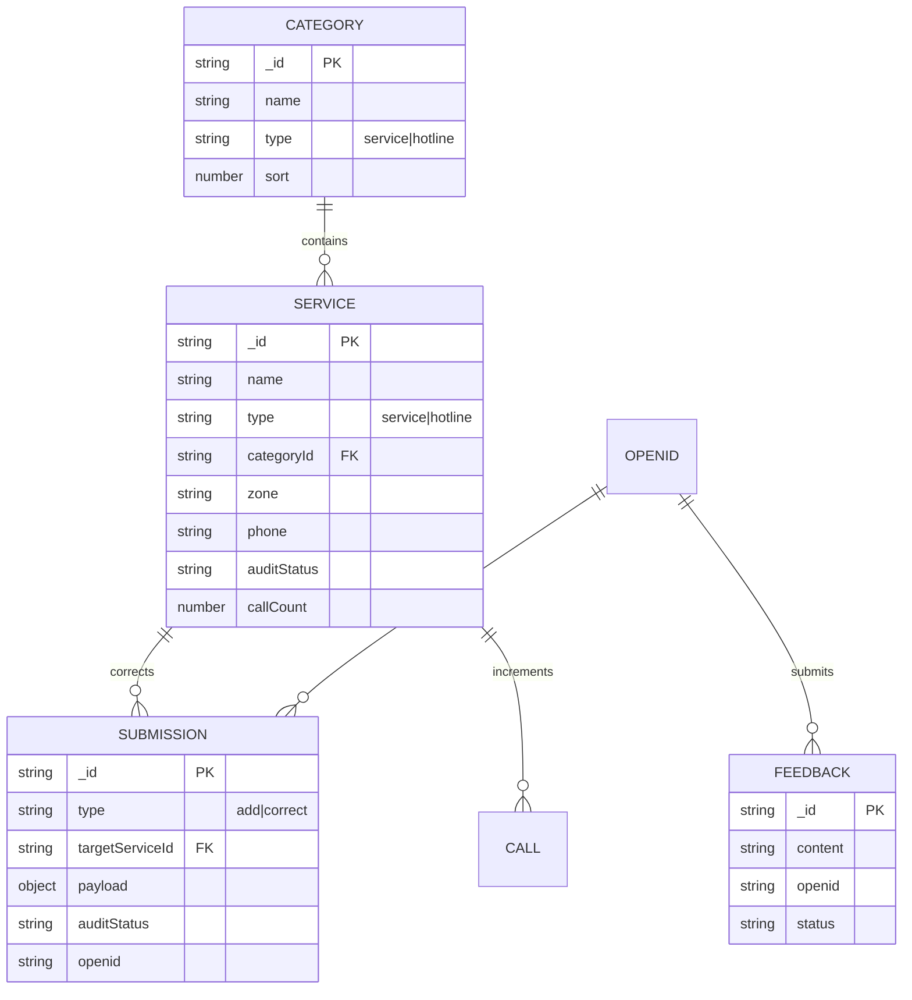
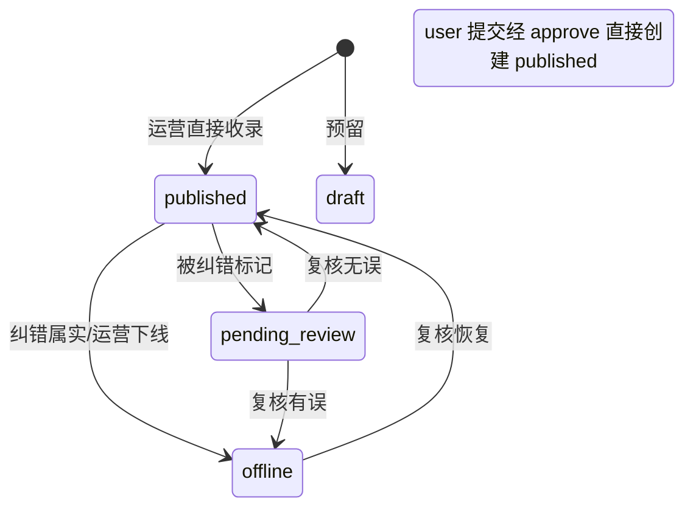

# DATABASE：天通苑社区信息服务平台（便民黄页）

| 项目 | 内容 |
| -- | -- |
| 版本 | v0.1（MVP） |
| 存储 | 微信云开发 · 云数据库（文档型 noSQL） |
| 试点组团 | 天通苑西二区 |
| 关联文档 | docs/PRD.md、docs/API.md |

---

## 1. 设计说明

- 采用云数据库文档模型，5 个业务集合 + 1 个配置集合，**无图片附件**（MVP 黄页纯文本，图片留待 v0.2）。
- 写入路径全部收敛在**云函数**内（提交、审核），小程序端只读或经云函数读写，避免开放直写风险。
- 字段命名统一 camelCase；状态字段用字符串状态机；常规字段 `createAt / updateAt / isDeleted`（软删除）。

## 2. 关系总览（ER）

> CALL 不建独立集合，拨打计数以 `services.callCount` 原子 `inc` 实现（见 §3.2）。

## 3. 集合结构

### 3.1 categories（分类目录，读写：公开读/运营写）

| 字段 | 类型 | 说明 |
| -- | -- | -- |
| _id | string | 主键 |
| name | string | 名称（如：开锁换锁） |
| type | string | `service` 便民分类 / `hotline` 常用热线分类 |
| icon | string | 图标 key（前端映射） |
| sort | number | 排序，小在前 |
| status | string | `enabled`/`disabled` |
| createAt/updateAt | date | 常规字段 |

索引：`(type, sort)`。
初始数据：10 个 service 分类 + hotline 固定一个「生活常用电话」分组的 key 配置（hotline 条目直接进 services.type=hotline）。

### 3.2 services（服务/热线条目，核心表）

| 字段 | 类型 | 说明 |
| -- | -- | -- |
| _id | string | 主键 |
| name | string | 名称（必填） |
| type | string | `service` / `hotline` |
| categoryId | string | 所属分类 |
| zone | string | 组团，默认「天通苑西二区」 |
| phone | string | 电话（必填，格式校验） |
| address | string | 地址（选填） |
| hours | string | 营业时间（选填） |
| desc | string | 描述 ≤200 字 |
| tags | array[string] | 检索标签 |
| auditStatus | string | 见状态机 §4 |
| callCount | number | 拨打计数，默认 0，云函数 `_.inc(1)` |
| reviewedAt | date | 最近人工核实时间（超 180 天打「待复核」） |
| source | string | `admin`（运营收录）/ `user`（用户提交经审核） |
| submitId | string | 来源 submissions._id（user 时） |
| rejectReason | string | 驳回原因（历史） |
| sort | number | 列表排序权重 |
| isDeleted | bool | 软删除 |
| createAt/updateAt | date | 常规字段 |

索引：
- `(auditStatus, isDeleted, sort)` —— 列表主查询
- `(auditStatus, isDeleted, categoryId, sort)`
- `(type, auditStatus)` —— 热线分组查询
- `(zone)` —— 试点过滤

### 3.3 submissions（收录/纠错申请）

| 字段 | 类型 | 说明 |
| -- | -- | -- |
| _id | string | 主键 |
| type | string | `add` 收录建议 / `correct` 纠错 |
| targetServiceId | string | 纠错目标（type=correct） |
| issueType | string | 纠错问题类型：phone_down/addr_wrong/not_exist/no_consent/other |
| payload | object | 收录内容：{name,categoryId,phone,zone,address,hours,desc} |
| auditStatus | string | `pending`/`done`/`rejected` |
| note | string | 审核备注/驳回原因 |
| openid | string | 提交人（写入者） |
| handledBy/handledAt | string/date | 审核信息 |
| createAt/updateAt | date | 常规字段 |

索引：`(auditStatus, createAt)`、`(openid, createAt)`。
频率：同一 openid 每日 add+correct ≤ 5 条（服务端统计当日 createAt）。

### 3.4 feedbacks（意见反馈）

| 字段 | 类型 | 说明 |
| -- | -- | -- |
| _id | string | 主键 |
| type | string | `bug`/`suggestion`/`other` |
| content | string | 内容 ≤500 字 |
| contact | string | 联系方式（选填） |
| openid | string | 提交人 |
| status | string | `open`/`closed` |
| createAt/updateAt | date | 常规字段 |

索引：`(status, createAt)`；频率：同 openid 每日 ≤ 3 条。

### 3.5 adminConfig（运营配置）

| 字段 | 说明 |
| -- | -- |
| _id = "admins" | 文档 |
| admins | array[string] openid 白名单，运营云函数鉴权用 |
| _id = "meta" | 文档：数据版本、上次全量核实日期、公告文案 |

## 4. 状态机

### services.auditStatus

> MVP 简化实现：`auditStatus ∈ published | pending | rejected | offline | draft`；其中 user 来源仅在 `published` 时可见；被纠错后由运营在控制台/审核函数中直接修正或下线，不必引入 pending_review 中间态（见 API admin.fix）。

### submissions.auditStatus

`pending → done（处理完成，含上线/修正/下线）` 或 `pending → rejected（驳回并备注原因）`

## 5. 权限与安全规则

| 集合 | 小程序端权限 | 说明 |
| -- | -- | -- |
| categories | 所有用户可读 | 规则：read true / write false |
| services | 所有用户可读 | 规则：read true / write false |
| submissions | 仅本人读 | 规则：read `doc.openid == auth.openid`；write false |
| feedbacks | 仅本人读 | 同 submissions |
| adminConfig | 不可读 | 规则：read false / write false，仅云函数 |

- 所有**写操作**（提交、拨打计数、审核）经云函数，客户端不直连集合写权限。
- 运营 admin 能力以 adminConfig.admins openid 白名单 + 云函数内校验实现。

## 6. 种子数据规划（上线前一次性导入）

由运营人工整理后，通过 `admin.batchImport`/控制台导入，约束如下：

| 内容 | 数量 | 要求 |
| -- | -- | -- |
| service 分类 | 10 | 见 PRD §9.1 |
| hotline 条目（常用热线） | ≥ 15 | 官方核实来源：物业、居委、派出所、社区医疗、供热供电燃气水务；号码公开可查 |
| 便民服务条目 | ≥ 25 | 覆盖 ≥ 8 个分类，西二区及步行可达实体；标注信息来源与核实日期 |

## 7. 扩展预留（v0.2+）

- 公告 collection：notices（title/body/top/expireAt）
- 邻里圈 collection：posts/comments
- 图片/附件：云存储 fileID 字段扩展
- 拨打明细 CALL 集合（如需分析再建，MVP 只累加 callCount）
