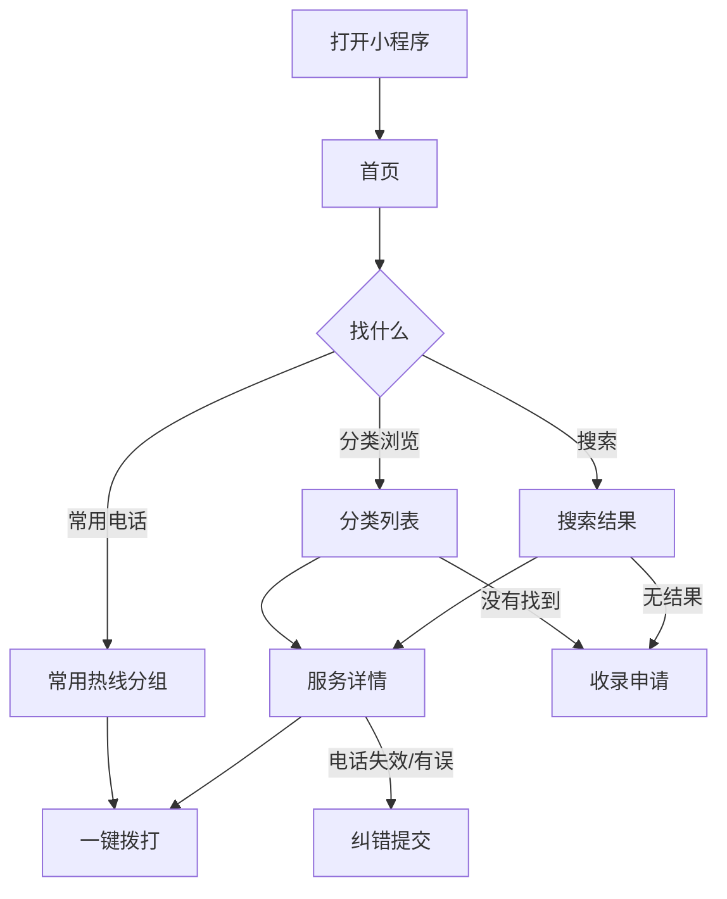
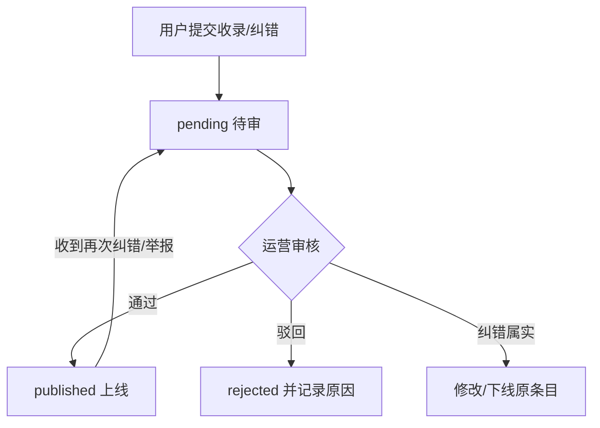

# PRD：天通苑社区信息服务平台（便民服务黄页）

| 项目 | 内容 |
| -- | -- |
| 版本 | v0.1（MVP） |
| 日期 | 2026-09-07 |
| 作者 | AI 独立开发工程师 |
| 状态 | 待评审 |
| 试点组团 | 天通苑西二区（v0.1 首发范围） |

---

## 1. 产品背景

- 天通苑是北京昌平区超大型居住社区，常住人口数十万，分为本区/北区/西区/东区/中苑等多个组团，生活配套需求旺盛。
- 居民找维修、家政、开锁、疏通、快递、回收等本地服务时，主要依赖业主群口口相传或 58/大众点评全网搜索，存在：**信息分散、良莠不齐、真假难辨、跨区服务远**等问题。
- 物业/居委会、派出所、供热、供电等**生活常用电话**没有统一的便民查询入口。
- 本项目由**业主自发、公益性质**发起，定位为纯信息整理与邻里互助，**不介入交易、不担保**，规避交易资质与商业类目合规风险。

## 2. 产品目标

- 让试点组团居民「**找本地服务、查常用电话，一个入口搞定**」。
- 用**内容质量 + 及时纠错**建立信任，验证「公益黄页」在社区的冷启动可行性与留存价值。

### MVP 验证指标（假设）

| 指标 | 目标 |
| -- | -- |
| 首批内容覆盖 | 天通苑西二区及邻近范围有效服务条目 ≥ 40 条；常用电话 ≥ 15 个 |
| 周活跃 | 试点组团周 DAU 均值 ≥ 30 |
| 有效互动 | 周「一键拨打」次数 ≥ 20；纠错/收录提交每月 ≥ 5 条有效反馈 |
| 内容健康度 | 条目被纠错后平均 7 天内完成核正/下线 |

## 3. 用户分析

| 类型 | 画像 | 需求 |
| -- | -- | -- |
| 核心用户 | 25-50 岁常住居民（上班族、宝妈、家庭用户） | 快速查到可信的本地服务与电话 |
| 重要用户 | 中老年居民（多为带娃父母） | 常用热线、就近服务，界面大字清晰 |
| 供给方 | 本地实体商户/个体服务者 | 被动被收录；可通过收录申请补充 |
| 平台方 | 运营者（业主个人） | 后台审核、纠错治理、内容更新 |

**痛点**：搜到的服务不本地、电话打不通、商户信息过时、误拨陌生号码怕被骗、没有官方电话的统一查询入口。

## 4. 使用场景

| # | 场景 | 前置条件 | 预期结果 |
| -- | -- | -- | -- |
| S1 | 家里下水道堵了，找疏通师傅 | 分类浏览「管道疏通」 | 看到本组团/就近条目，一键拨打 |
| S2 | 忘带钥匙，需要开锁 | 搜索「开锁」 | 展示开锁条目 + 温馨提示（核实资质/报警报备） |
| S3 | 缴纳供热前咨询、停电报修 | 首页「常用热线」 | 直接查到供热/供电/物业电话 |
| S4 | 发现某商户电话已停机 | 条目详情页 | 走「纠错」提交通道 |
| S5 | 邻居推荐了一家修手机的，平台还没有 | 首页/分类页 | 走「收录申请」通道，提交后进待审 |
| S6 | 对条目真实性存疑 | 任意页面 | 查看公益声明/免责声明，并可举报纠错 |

## 5. 功能列表

### P0（MVP 必须）

| 模块 | 功能 | 说明 |
| -- | -- | -- |
| 首页 | 搜索入口、分类宫格、常用热线、推荐服务、公益声明入口 | 聚合导航 |
| 分类浏览 | 按分类分页列表、按组团过滤、空态引导 | 信息查询主体 |
| 搜索 | 按名称/分类/标签关键词检索 | 小数据量先简单匹配 |
| 服务详情 | 图文信息、营业时间、地址、一键拨打、纠错入口 | 核心查询对象 |
| 常用热线 | 独立分组：物业/居委/派出所/社区医院/水电气热等 | 官方电话专区 |
| 收录申请 | 用户提交新增服务/商户信息 | 保证内容可持续增长 |
| 纠错反馈 | 用户反馈条目错误/失效/不愿展示 | 内容治理闭环 |
| 个人中心 | 我的提交记录、意见反馈、关于/免责声明 | 轻量用户功能 |
| 后台审核 | 云开发控制台管理发布/下线/合并 | 运营最小闭环 |

### P1（试点验证后，v0.2）

- 社区公告（物业/居委通知，置顶与自动下线）
- 邻里互助信息圈（闲置/拼车/求助，分类发布）
- 收藏与常用列表、拨打统计排行

### P2（后续，v1.x）

- 地图就近服务、评价体系、社区问答、活动报名、多组团切换运营

## 6. 功能详细说明（P0）

### 6.1 首页（home）

- 顶部搜索框（点击进入搜索态）
- 「生活常用电话」快捷宫格：物业、居委会、派出所、社区卫生服务中心、供热、供电、燃气、水务、开锁（防盗门报警备案提示）
- 「便民服务」分类宫格：约 10 个分类（见 §9.1），点击进分类列表
- 「推荐服务」区：运营置顶/热门的 3-5 条 published 条目
- 底部固定按钮：**「我要收录 / 纠错」**（进入提交表单）

### 6.2 分类浏览 / 搜索结果列表

- 顶部 Tab：全部 / 常用电话 / 各分类（横向可滚动）
- 列表项：图标、名称、分类、简短描述（1 行）、距离/组团标签（如有）
- 分页加载，一次 20 条；空态：引导「提交收录建议」
- 每条默认展示，电话按钮一键拨打（`wx.makePhoneCall`）

### 6.3 服务详情

- 展示字段：名称、分类、组团、电话（大按钮一键拨打）、地址、营业时间、服务描述、收录时间/核实状态标签
- 操作：纠错（填写原因）、分享
- 尾部注明：「信息由平台公益整理，请自行核实；如电话失效或商户不愿展示，可点击纠错，我们将尽快处理」

### 6.4 收录申请（含纠错共用表单骨架）

- 必填：服务/商户名称、分类、联系电话
- 选填：组团、地址、营业时间、描述（≤200 字）
- 纠错类型额外字段：原条目定位 + 错误原因
- 提交即入库为 `pending` 状态；成功后提示「已收到，核实后上线，一般 1-3 个工作日」
- 同一 openid 每日限 5 次，防止刷量

### 6.5 个人中心

- 我的提交（收录/纠错记录 + 状态展示：待审核/已上线/已驳回/已处理）
- 意见反馈（bug/建议/其他）
- 关于与公益声明、免责声明、隐私政策入口
- 登录采用微信 openid（静默，仅在需要身份时提示授权头像昵称可选）

### 6.6 后台审核（MVP 用云开发控制台）

- 运营者在云开发「数据管理」中处理 `pending`：审核通过 → 写入 `services`（published）；驳回 → 更新 submission 状态并注明原因；失效 → 下线
- 发布前对文本调用内容安全接口 `msgSecCheck`；图片 `imgSecCheck`

## 7. 用户流程

### 7.1 查询主流程

### 7.2 内容治理流程

### 7.3 异常流程覆盖

- 未登录：浏览不受限；提交需 openid（静默获得，失败则提示重试）
- 无数据：空态 + 引导提交收录
- 网络异常：列表页 loading/error 重试；拨打失败 toast
- 条目下线/已删除：详情页提示「信息不存在或已下线」
- 提交频率超限：提示明日再试

## 8. 页面说明

| 页面 | 路径 | 目标 | 状态要求 |
| -- | -- | -- | -- |
| 首页 | pages/home/home | 聚合入口 | Loading/Empty/Error/Offline |
| 分类与搜索列表 | pages/list/list | 结果查询 | Loading/Empty/Error/下拉刷新 |
| 详情 | pages/detail/detail | 展示+拨打+纠错 | Loading/NotFound |
| 提交（收录/纠错） | pages/submit/submit | 内容增长闭环 | 表单校验/成功/失败 |
| 个人中心 | pages/profile/profile | 我的记录与设置 | Empty/Success |
| 我的提交 | pages/mine/mine | 状态查询 | Loading/Empty |
| 意见反馈 | pages/feedback/feedback | 反馈 | 成功/失败 |
| 关于与声明 | pages/about/about | 合规与信任 | 静态 |

- 全局 UI 规范（颜色/字体/间距/圆角/按钮/空态/Toast）在 UI 阶段统一输出。
- 常用热线与推荐服务支持本地缓存，减少加载等待。

## 9. 业务规则

### 9.1 分类目录（首批默认，运营可调）

生活常用电话（独立分区）：物业、居委会、派出所、社区卫生服务、供热、供电、燃气、水务、道路救援（如有）。

便民服务分类（约 10 类）：
维修安装（水电/家电/手机电脑/门窗）、家政保洁、开锁换锁、搬家货运、管道疏通、废品回收、快递驿站/代收、干洗缝补、配钥匙、宠物服务。扩展可选：桶装水配送、洗车救援、驾培、桶装水奶站等。

> MVP 默认采用以上 10 类（已按此推进），如需增减请提出。

### 9.2 条目规则

- 必须含联系电话，号码需通过基础格式校验（1[3-9]xxxx + 座机规则）；只收录**天通苑西二区及邻近组团（步行可达范围）实体服务或官方电话**。
- 重复收录：同名同号自动合并去重；重复提交打回。
- 状态机：`pending → published / rejected / offline`；published 条目被纠错后回到 pending 复核。
- 核实标签：展示「运营核实日期」；超过 180 天无触碰的商家条目列为「待复核」（运营批量抽查）。
- 免责：条目来自公开信息与用户提交，平台只做公益整理，不构成推荐与担保；商户不愿展示可申请下线。

### 9.3 治理规则

- 文本/图片发布前过内容安全接口；命中即拒绝。
- 广告、疑似诈骗、涉黄涉政、跨类目推广一律拒绝。
- 紧急号码（公安/消防/急救）不出现在商户条目中，以官方热线专区分开展示。

### 9.4 运营规则

- 试点模式：仅试点组团数据对外；其他组团数据不上首页（字段保留，未来扩展）。
- 后台操作留痕：发布/下线/驳回记录 audit log（简单存 submission/服务状态字段即可）。

## 10. 权限规则

| 动作 | 权限 |
| -- | -- |
| 浏览/搜索/拨打 | 游客可（无需登录） |
| 提交收录/纠错/反馈 | 需 openid（静默登录），头像昵称可选授权 |
| 后台审核/发布/下线 | 仅运营者（云开发控制台 + 安全规则） |
| 内容安全 | 云调用 msgSecCheck / imgSecCheck |
| 数据安全 | 云数据库权限：服务列表公开读；提交表仅本人读 + 运营写 |

## 11. 异常情况

| 场景 | 处理 |
| -- | -- |
| 拨打失败 | toast 提示，保留号码供复制 |
| 电话疑似诈骗/骚扰 | 详情页提供「举报」→ 走纠错治理，紧急号码官方源不受影响 |
| 提交内容命中敏感词 | 拒绝提交并提示原因（不泄露检测细节） |
| 云函数限流/超时 | 前端重试 + 友好提示 |
| 并发拨打统计 | 使用 inc 原子累加 |
| 小程序审核被拒 | 对照类目与资质风险清单整改（见 §15 风险） |

## 12. 边界条件

- 号码格式非法、空名称 → 表单校验拦截。
- 描述超 200 字截断；提交内容单次 ≤ 500 字符。
- 同 openid 每日提交 ≤ 5 次；列表防重复点击、提交防抖。
- 分页游标基于 `_id`，无数据返回空态。
- 组团未指定时默认归入试点组团。
- 发布时间仅用于纠错排序；条目无过期，但按 §9.2 打「待复核」标记。
- 离线：常用热线数据本地缓存可用；拨打按钮离线时提示联网。

## 13. 数据要求（微信云开发 · 云数据库）

### services（服务/热线条目）

| 字段 | 类型 | 说明 |
| -- | -- | -- |
| _id | string | 主键 |
| name | string | 名称 |
| type | string | `service` 便民服务 / `hotline` 常用热线 |
| categoryId | string | 所属分类（hotline 时固定） |
| zone | string | 组团，试点默认「天通苑西二区」 |
| phone | string | 联系电话 |
| address | string | 地址（选填） |
| hours | string | 营业时间（选填） |
| desc | string | 描述 ≤200 字 |
| tags | array | 检索标签 |
| auditStatus | string | published/pending/rejected/offline |
| callCount | number | 拨打次数（inc 累加） |
| reviewedAt | date | 最近核实时间 |
| source | string | admin/user |
| sort | number | 排序权重 |
| createAt/updateAt/isDeleted | - | 常规字段 |

索引：`(auditStatus, categoryId, sort)`、`(auditStatus, zone)`、`(type)`。

### submissions（收录/纠错）

| 字段 | 说明 |
| -- | -- |
| type | addService / correct / remove |
| targetServiceId | 纠错目标（如适用） |
| payload | 表单数据对象 |
| auditStatus | pending / done / rejected |
| note | 审核备注 |
| openid | 提交人 |
| createAt/updateAt | 常规字段 |

### feedbacks（意见反馈）、categories（分类配置，含 hot 标识）

### 搜索方案

MVP 数据量小：名称/描述用 `db.RegExp` 前缀/包含匹配 + 分类过滤即可，后续量大再换搜索服务。

## 14. MVP 范围

### 必须做（P0）

首页、分类浏览、搜索、服务详情（一键拨打）、常用热线、收录申请、纠错反馈、个人中心（我的提交/意见反馈/声明）、后台审核闭环、内容安全接入。

### 明确不做（Non-goals，防止范围蔓延）

- ✗ 交易/下单/支付/担保（规避资质）
- ✗ 站内即时通讯
- ✗ 邻里信息圈/论坛 UGC 流（v0.2 再做）
- ✗ 商家自主入驻/广告投放
- ✗ 地图服务/账号体系/自建后台管理页面（用云开发控制台替代）

### 验收标准（DoD）

- [ ] 天通苑西二区范围内可完成「分类 → 详情 → 一键拨打」全流程
- [ ] 常用热线 ≥ 15 个官方电话，浏览无需登录
- [ ] 用户可提交收录/纠错，提交后进入待审，运营可在控制台完成发布/驳回/下线
- [ ] 文本/图片发布前均过内容安全检测
- [ ] 首页/列表有 Loading、Empty、Error、Offline 四态
- [ ] 公益/免责/隐私声明文案齐备
- [ ] 全部 P0 用例通过（测试阶段输出 TEST_CASES）

## 15. 后续规划与风险

### 版本路线

| 版本 | 内容 |
| -- | -- |
| v0.1（MVP） | 便民黄页 + 常用热线 + 收录/纠错闭环 |
| v0.2 | 社区公告、邻里互助信息圈、收藏 |
| v0.3 | 拨打排行、评价、活动报名 |
| v1.0 | 多组团扩展 + 运营工具化 |

### 风险与对策（重点）

| 风险 | 对策 |
| -- | -- |
| 个人主体小程序类目受限，含商户名录可能涉及广告/商业内容 | 上线前先在小程序后台**核验可用类目**；必要时弱化「商家推广」表述为「便民信息整理」；预留整改方案 |
| 小程序 ICP 备案要求 | 立项期同步准备主体与备案材料 |
| 商户未授权被收录引发投诉 | 收录页与详情页显著提供「不愿展示可删除」通道 + 纠错闭环 |
| 内容过时、电话失效 | 拨打统计 + 定期复核标记 + 用户纠错激励机制 |
| 诈骗号码/虚假信息 | 官方热线独立专区；商户条目人工审核；举报快速下线 |
| 试点冷启动内容不足 | 上线前人工沉淀首批 ≥ 40 条种子数据，分批运营发布 |

### 决策记录与待确认事项（进入 UI/编码前）

1. ✅ 已确认：试点组团 = **天通苑西二区**（v0.1 数据范围）。
2. 首批分类目录按 §9.1 默认 10 类执行（已按此假设推进），如需增减请提出。
3. MVP 范围与「不做清单」默认按第 14 章执行。
4. 「意愿登记/上线预热」类前置功能默认后置，不做进 v0.1。
