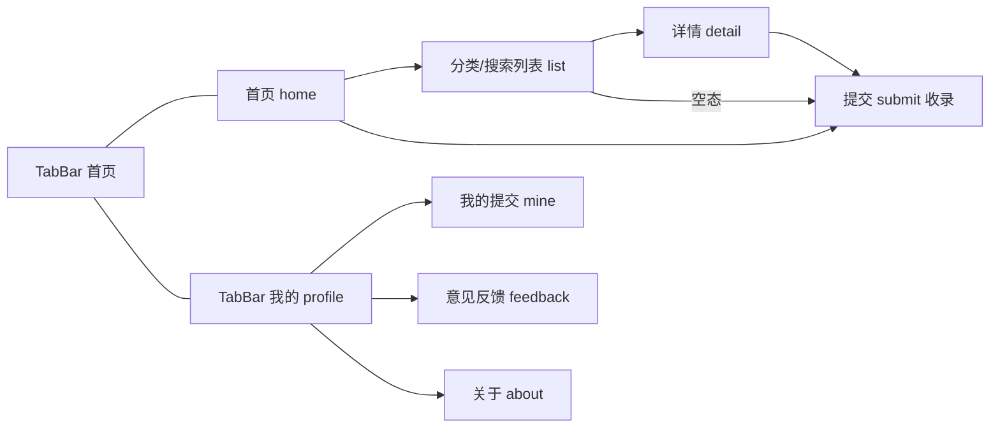
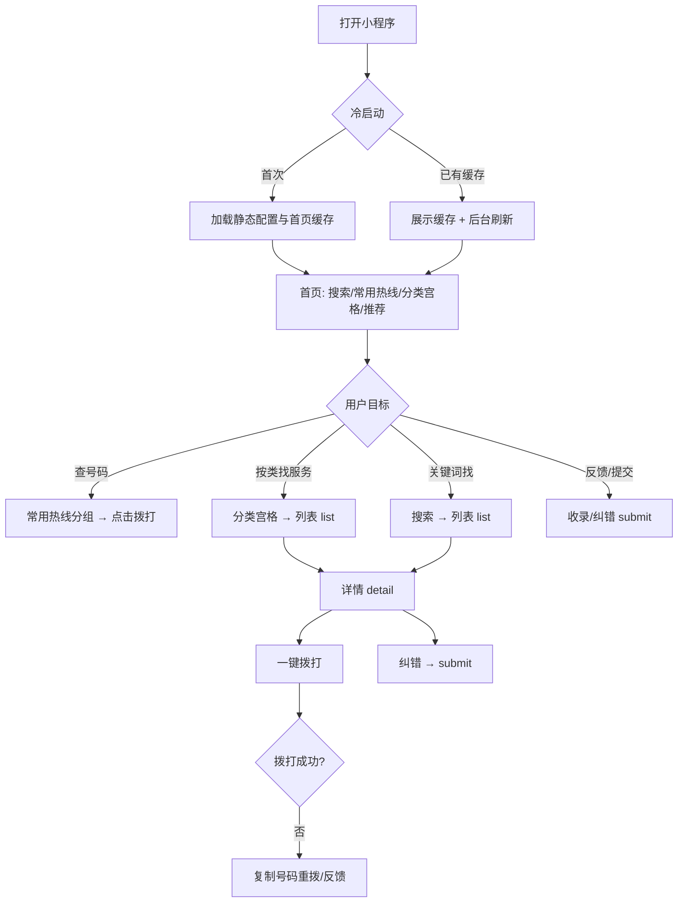
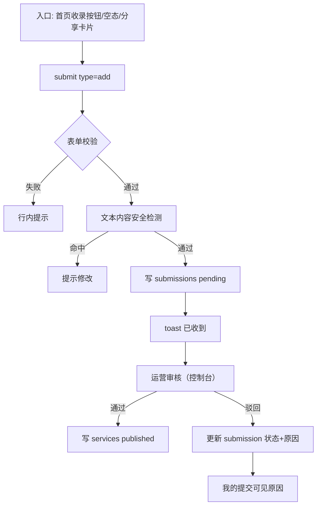
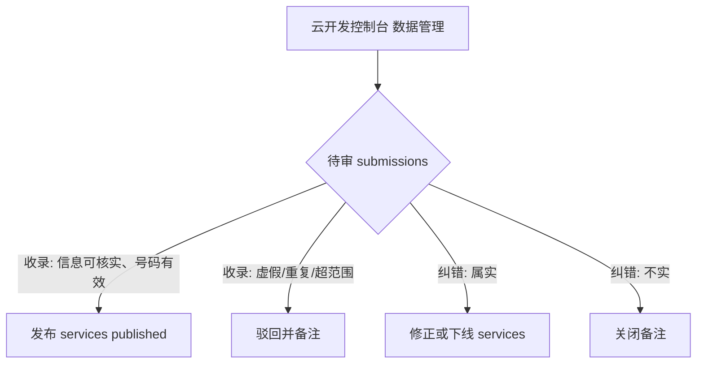

# USER_FLOW：天通苑社区信息服务平台（便民黄页）

| 项目 | 内容 |
| -- | -- |
| 版本 | v0.1（MVP） |
| 关联文档 | docs/PRD.md、docs/UI_DESIGN.md |
| 试点组团 | 天通苑西二区 |

---

## 1. 角色与入口

| 角色 | 说明 | 主要入口 |
| -- | -- | -- |
| 游客 | 未登录即可浏览/拨打 | 首页 |
| 居民用户 | 浏览 + 提交收录/纠错/反馈 | 首页/详情/列表空态 |
| 运营者 | 审核、发布、下线 | 云开发控制台（不在小程序内） |

导航结构：底部 TabBar 两栏（首页 / 我的），详情、列表、提交、意见反馈、关于为二级页面。

## 2. 主流程总览

## 3. 详细流程

### 3.1 登录态处理

- 浏览类操作（首页、列表、详情、拨打）：**游客可用，不弹登录**。
- 提交类操作（收录/纠错/意见反馈）：进入页面时静默 `wx.login` + 云函数换取 openid；失败时页面正常渲染，点击「提交」时重试，仍失败则 toast 提示「登录状态异常，请重试」。
- 头像/昵称仅在个人中心可选展示，不强制授权。

### 3.2 查询主链路

1. 首页加载：并行请求（配置/分类、常用热线、推荐服务、本组团团目），骨架屏过渡。
2. 常用热线：宫格直达，点击 → 拨号确认弹窗 → `wx.makePhoneCall`。
3. 分类浏览：`list?type=category&categoryId=x` → 分页拉取 published 条目 → 点击进详情。
4. 搜索：`list?type=search&keyword=k`，对名称/描述做包含匹配；无结果给空态引导收录。
5. 详情：展示字段；拨打 → 计数 +1（云函数 inc）；纠错 → `submit?type=correct&serviceId=xxx` 预填条目名。

### 3.3 收录申请流程

### 3.4 纠错流程

1. 详情页「纠错」→ 预填目标条目。
2. 用户选择问题类型：电话失效 / 地址或信息有误 / 服务不存在 / 商户不愿展示 / 其他。
3. 同收录共用表单骨架，提交至 `submissions(type=correct)`。
4. 运营核实：生效则修正或下线原条目；不成立则关闭并备注。提交人可在「我的提交」看处理结果。

### 3.5 我的提交 / 意见反馈

- mine：按提交时间倒序展示收录/纠错记录与状态徽标（待审核/已上线/已驳回/已处理/已下线）。
- feedback：类型（问题反馈/功能建议/其他）+ 内容 + 可选联系方式。

### 3.6 后台审核（运营，控制台操作）

## 4. 异常与状态流程矩阵

| # | 异常/状态 | 触发场景 | 页面表现 | 处理 |
| -- | -- | -- | -- | -- |
| E1 | Loading | 首次拉取 | 骨架屏/顶部 loading | 数据就绪即替换 |
| E2 | Empty | 分类无条目/搜索无结果 | 插画 + 「还没有收录，帮大家补充」 | 引导进收录 |
| E3 | 网络异常 | 断网/请求失败 | 错误占位 + 重试按钮 | 首页缓存仍可显示常用热线 |
| E4 | Offline 弱网 | 请求超时 | toast「网络开小差」 | 自动重试一次 |
| E5 | 条目不存在/下线 | 分享进入已下线详情 | 「信息不存在或已下线」占位 | 返回列表/首页 |
| E6 | 拨打失败 | 号码无效/被拦截 | toast 失败 | 提供复制号码 |
| E7 | 未登录提交 | openid 获取失败 | 提交按钮点击提示重试 | 不阻断浏览 |
| E8 | 表单校验失败 | 名称/号码非法、超长 | 行内红字提示 | 定位首个错误输入框 |
| E9 | 命中敏感词 | 提交文本不合规 | 提示修改后重试 | 不落库 |
| E10 | 频率超限 | 同一 openid 当日 >5 次 | toast「今日提交已达上限」 | 次日恢复 |
| E11 | 重复提交 | 防抖失效/双击 | 二次点击置灰 | 前端防抖 + 服务端校验 |
| E12 | 审核中再次纠错 | 条目 pending | 详情仍展示旧信息并标「待复核」 | 运营排队处理 |

## 5. 页面状态覆盖核对表

| 页面 | Loading | Empty | Success | Error | Offline | 其他 |
| -- | -- | -- | -- | -- | -- | -- |
| home | ✅ 骨架 | ✅ 分类无数据占位 | ✅ | ✅ 重试 | ✅ 缓存兜底 | - |
| list | ✅ | ✅ 空态引导收录 | ✅ | ✅ 重试 | ✅ toast | 分页加载更多 |
| detail | ✅ | - | ✅ | ✅ | - | NotFound（下线） |
| submit | - | - | ✅ 成功反馈 | ✅ 提交失败保留内容 | ✅ toast | 行内校验 |
| profile | ✅ | ✅ | ✅ | ✅ | - | - |
| mine | ✅ | ✅ 无记录引导 | ✅ | ✅ 重试 | - | 状态徽标 |
| feedback | - | - | ✅ | ✅ | ✅ | 频率限制 |
| about | - | - | 静态 | - | - | - |
